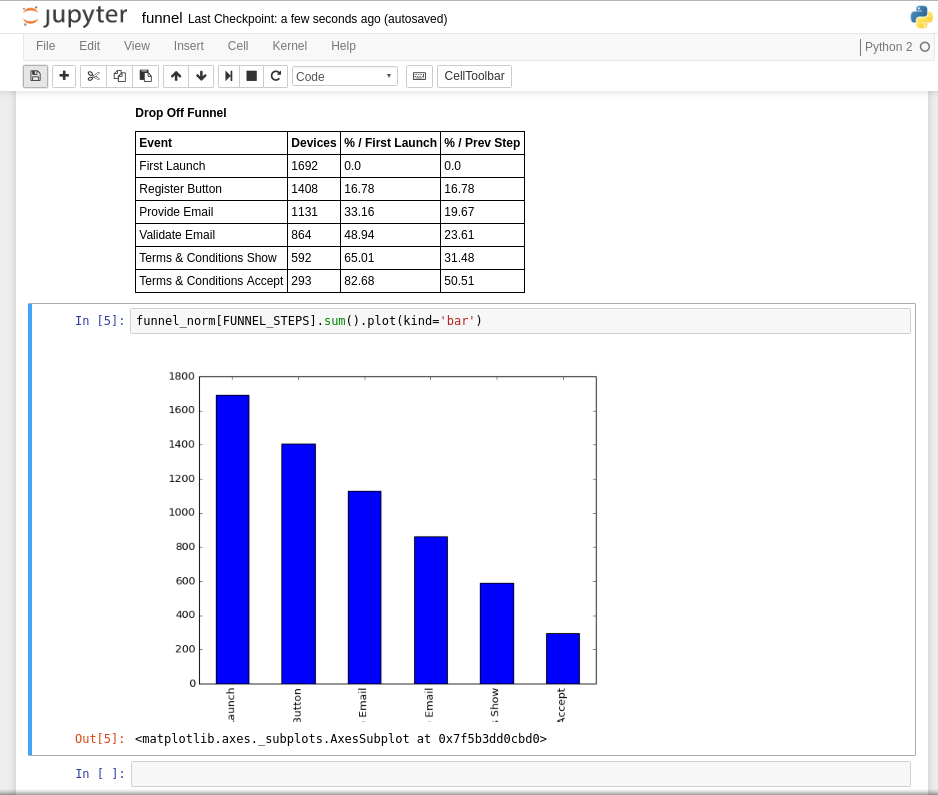

# Sample Funnel Analysis

A sample funnel analysis notebook that shows where people have dropped off.

Full credits to [Brendan Sudol](https://github.com/brendansudol/funnel-analysis) for his [funnel analysis repository](https://github.com/brendansudol/funnel-analysis). Without that, I would've had to read the entire documentation on _jupyter_ and _pandas_.

* Setup environment at parent directory as explained there
* Create sample data set by running `python create-sample-events.py > events.csv`
* On the notebook (http://localhost:8888/), navigate to the notebook.
* Run cell-by-cell to see how it is.

Hack away.

It should look like the screenshot below.

